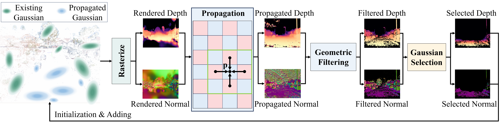

<div align="center">

  <h1 align="center">GaussianPro: 3D Gaussian Splatting with Progressive Propagation</h1>

### [Project Page](https://kcheng1021.github.io/gaussianpro.github.io/) | [Paper](https://arxiv.org/abs/2402.14650)

</div>

<div align="center">

</div>

## 📖 Abstract

The advent of 3D Gaussian Splatting (3DGS) has recently brought about a revolution in the field of neural rendering, facilitating high-quality renderings at real-time speed. However, 3DGS heavily depends on the initialized point cloud produced by Structure-from-Motion (SfM) techniques.
When tackling with large-scale scenes that unavoidably contain texture-less surfaces, the SfM techniques always fail to produce enough points in these surfaces and cannot provide good initialization for 3DGS. As a result, 3DGS suffers from difficult optimization and low-quality renderings.
In this paper, inspired by classical multi-view stereo (MVS) techniques, we propose **GaussianPro**, a novel method that applies a progressive propagation strategy to guide the densification of the 3D Gaussians. 
Compared to the simple split and clone strategies used in 3DGS, our method leverages the priors of the existing reconstructed geometries of the scene and patch matching techniques to produce new Gaussians with accurate positions and orientations.
Experiments on both large-scale and small-scale scenes validate the effectiveness of our method, where our method significantly surpasses 3DGS on the Waymo dataset, exhibiting an improvement of 1.15dB in terms of PSNR.


## 🗓️ TODO
- [✔] Code pre-release -- Beta version.
- [✔] Demo Scenes.
- [ ] CUDA acceleration -- Official version.

## 🚀 Pipeline

<div align="center">

</div>


## 🚀 Setup
#### Tested Environment
Ubuntu 20.04.1 LTS, GeForce 3090, CUDA 11.3 (tested) / 11.7 (tested)

#### Clone the repo.
```
git clone https://github.com/kcheng1021/GaussianPro.git
```

#### Environment setup 
```
conda env create --file environment.yml

cd ./submodules/Propagation
cmake .
make
```

#### Download the demo Waymo scene: Segment-102751
```
wget https://drive.google.com/file/d/1DXQRBcUIrnIC33WNq8pVLKZ_W1VwON3k/view?usp=sharing
```

#### Besides the public datasets, we also test GaussianPro from random selected Youtube videos and find consistent improvement. The processed data is provided below. 

```
#youtube01: Park.
wget https://drive.google.com/file/d/1iHYTnI76Zx9VTKbMu1zUE7gVKP4UpBan/view?usp=sharing

#youtube02: Church
wget https://drive.google.com/file/d/1i2ReAJYkeLHBBbs_8Zn560Tke2F8yR1X/view?usp=sharing

#youtube03: The forbidden city.
wget https://drive.google.com/file/d/1PZ_917Oq0Y45_5dJ504RxRmpUnewYmyn/view?usp=sharing

#youtube04: Eiffel tower.
wget https://drive.google.com/file/d/1JoYyfAu3RNnj12C2gPvfljHLUKlUsSr1/view?usp=sharing
```


#### Run the codes 
```
# Run the 3DGS, we modify the defaulting parameters in 3DGS to better learn large scenes.
bash scripts/train_baseline.sh

# Run the GaussianPro, the description of parameters in GaussianPro will come out later.
bash scripts/train.sh
```

To ensure the reproducibility, we present a reference of the results in the provided demo scenes based on the current code.
|  | Waymo-1002751 | Youtube-01 | Youtube-02 | Youtube-03 | Youtube-04 |
| :--- | :---: | :---: | :---: | :---: | :---: | 
| 3DGS | 35.22,0.950,0.234 | 34.40,0.964,0.092 | 34.67,0.954,0.072 | 37.81,0.971,0.081 | 33.05,0.950,0.079 |
| GaussianPro | **35.97,0.959,0.207** | **35.29,0.969,0.076** | **35.08,0.959,0.064** | **38.27,0.974,0.072** | **33.66,0.956,0.072** |

## 🎫 License

For non-commercial use, this code is released under the [LICENSE](LICENSE).
For commercial use, please contact Xuejin Chen.


